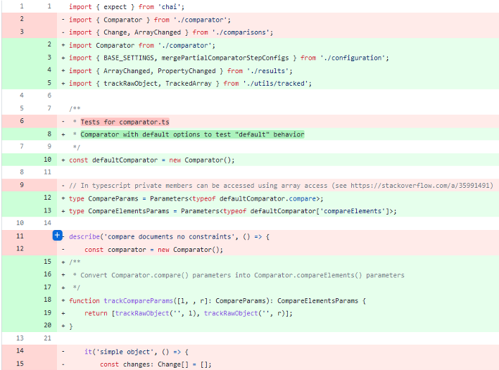
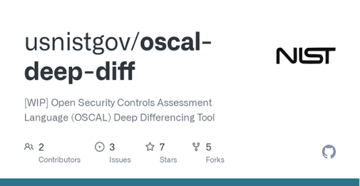
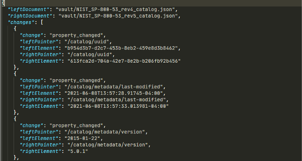
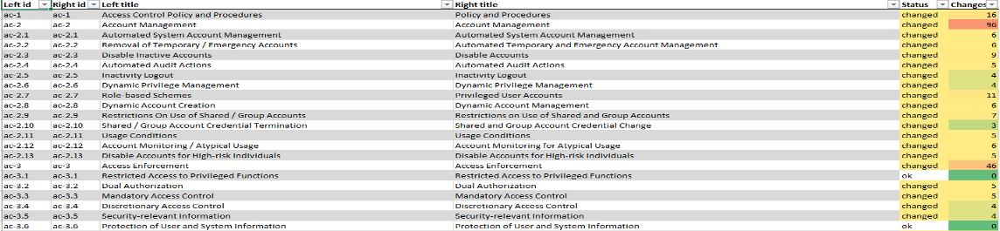
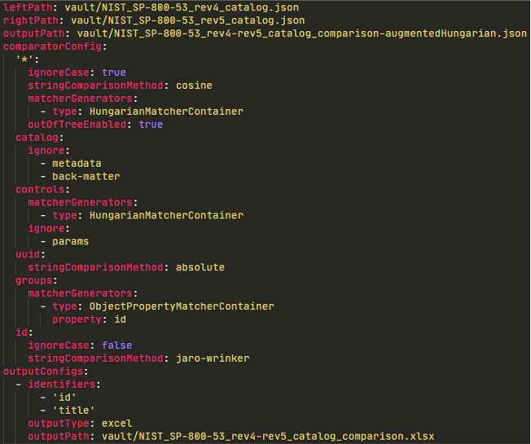
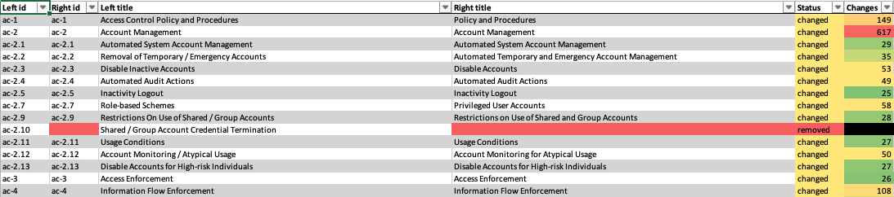

<!--
_paginate: false
_class: invert workshop radialbg
-->

# OSCAL "Deep Diff" Introduction
Nikita Wootten (Computer Scientist @ NIST ITL)

---

## The problem: **large documents are difficult to digest**

OSCAL catalogs are no exception!

| ✍️ Authors | 🧾 Catalog Consumers | 🧑‍💻 Developers |
| - | - | - |
| How do I track changes that my team has made between revisions of a document? | How can I produce a checklist of controls with relevant changes when a new revision of a control catalog comes out? | How can I track when certain types of changes to a document happens, and make decisions based on those change-lists (such as in a CI/CD pipeline)? |

---

<!--
_footer: " OSCAL Deep Diff Introduction"
_class: workshop
-->

### The solution: A "diff" tool for OSCAL documents

* A tool that compares OSCAL documents
* Should adapt to different scenarios (not just catalogs)
* Machine-readable and human-readable outputs
* Portable and extendable so that it can be integrated into other tools (such as web applications)



---

<!--
_footer: " OSCAL Deep Diff Introduction"
_class: workshop
-->

### OSCAL Deep Diff introduction

* An open-source TypeScript CLI and library that can be used to compare JSON objects
* Does not rely on a schema, can be configured to reproducibly compare documents
* Generates outputs in multiple formats including easy-to-distribute Excel spreadsheets
* Can be integrated into Javascript applications



---

<!--
_class: invert workshop radialbg
-->

# Scenario: a basic comparison

[🔗 Appendix Slides](#appendix-a-a-basic-comparison)

---

## Output format



- By default OSCAL deep diff produces a JSON document listing the differences between 2 documents
- Array properties (`groups`, `controls`, etc.) have sub-lists of changes for each matched pair.

---

## Output format (continued)



Alternatively an Excel output can be used to collect changes from a property (e.g. all controls in a catalog)

---

## Configuration



The tool can be configured to change the comparison behavior:
- Ignore irrelevant changes (`uuid` shifts, etc)
- Specify how properties should be compared (ignore case, string similarity)
- Specify how arrays should be matched and compared

...as well as the output format (JSON, Excel)

---

## Under the hood: how comparisons work

* Document -> tree of `primitive`, `object`, and `array` nodes
* Recursively compare nodes:
  * For `objects`, find properties in common, and compare their children.
  * For `arrays`, find pairs of array items that *minimize* the number of changes overall.



<!--
The Hungarian (Munkres) algorithm is used to assign array pairs:
- The algorithm is instructed to find pairs that minimize the "score"
- Comparison behavior can be tweaked to ignore certain members
-->

---

<!--
_class: invert workshop radialbg
-->

# Scenario: tailoring a catalog comparison

[🔗 Appendix Slides](#appendix-b-tailoring-a-catalog-comparison)

---

## Shortcomings

* Speed of comparisons
    - Array comparison algorithms are computationally expensive!
* Comparison behavior tuning
    - Users must tweak tool to fit a scenario
    - This tool does not replace the job of an analyst!
* Comparison results
    - Some scenarios are not supported yet, such as object demotion/promotion

<!--
An example of object promotion/demotion would be an enhancement becoming a control (or vice versa)
-->

---

<!--
_class: invert workshop radialbg
-->

## Call to action

If this tool is exciting or potentially useful to you:
- Please provide feedback, bug reports, and suggest improvements:

    https://github.com/usnistgov/oscal-deep-diff


---

# 📚 Appendices

- [A](#appendix-a-a-basic-comparison): a basic comparison
- [B](#appendix-b-tailoring-a-catalog-comparison): tailoring a catalog comparison

---

## Appendix A: a basic comparison

* O.D.D. can be invoked from the command line using the `oscal-deep-diff` command.
* O.D.D. requires a configuration file, which at minimum looks like:

    ```yaml
    comparatorConfig: {}
    ```
* Let's compare two documents, `old.json` and `new.json`:

    ```sh
    $ oscal-deep-diff \
		--leftPath old.json \
		--rightPath new.json \
		--outputPath comparison_basic.json \
		--config config_comparison_basic.yaml
    ```

---

### Appendix A.i: the output format

```json
{
  "leftDocument": "old.json",
  "rightDocument": "new.json",
  "changes": [
    {
      // or property_left_only, property_right_only, array_changed
      "change": "property_changed",
      "leftPointer": "/component-definition/uuid",
      "leftElement": "8223d65f-57a9-4689-8f06-2a975ae2ad72",
      "rightPointer": "/component-definition/uuid",
      "rightElement": "e49f18fa-b9dc-4131-9f56-7e9725e32f8c"
    },
    // ...
  ]
}
```

---

### Appendix A.ii: customizing the output

Let's say we want to ignore specific properties from our comparison:

```yaml
comparatorConfig:
  # Omit UUID changes from comparisons:
  "*":
    ignore:
      - uuid
      - "*uuid*"

```

---

### Appendix A.iii: conclusion

In this appendix we've explored:
* How to use the `oscal-deep-diff` CLI tool to compare revisions of a basic document
* How to tailor the comparison to ignore `UUID` values

[⏮️ Back to the slides](#scenario-a-basic-comparison)

---

## Appendix B: tailoring a catalog comparison

```yaml
comparatorConfig:
  "*": # The "*" pattern serves sets the default behavior for all objects
    ignoreCase: true
    stringComparisonMethod: cosine
    matcherGenerators: # Control how array items are matched
      # The Hungarian algorithm is the most intensive matching method
      - type: HungarianMatcherContainer
    # "out of tree" matching allows array items to move from one parent to another
    outOfTreeEnabled: true
  uuid:
    stringComparisonMethod: absolute # Later defined matches can override settings
  groups:
    matcherGenerators:
      # Some matcher generators can constrain how matching happens
      - type: ObjectPropertyMatcherContainer
        property: id
  id:
    # Jaro-Winkler comparison weights earlier letters as more significant, e.g.:
    # "ac-8" & "ac-7" are more similar than "ac-8" & "au-8"
    stringComparisonMethod: jaro-winkler
```

---

### Appendix B.i: exporting an Excel document for analysis

For larger documents, the JSON comparison may not be suitable for human analysis.

```yaml
outputConfigs:
  - selection: controls
    identifiers: ["id", "title"]
    outputType: excel
    outputPath: comparison_controls.xlsx
```

This configuration produces:
- A filterable breakdown of all `controls` objects in the compared documents
  - What controls have been `added`, `removed`, `changed`, or `ok`
  - A more detailed list of changes for a given control
  - The parent (`group`/`control`) that a control belongs to

---

### Appendix B.ii: exporting an Excel document for analysis (continued)



---

### Appendix B.iii: Conclusion

In this appendix we've explored:
* Comparing revisions of the FedRAMP resolved control catalog
* The different ways that comparisons can be tailored
* How to export an Excel document for analysis

[⏮️ Back to the slides](#scenario-tailoring-a-catalog-comparison)
